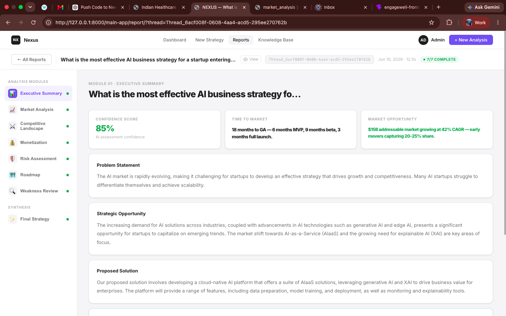
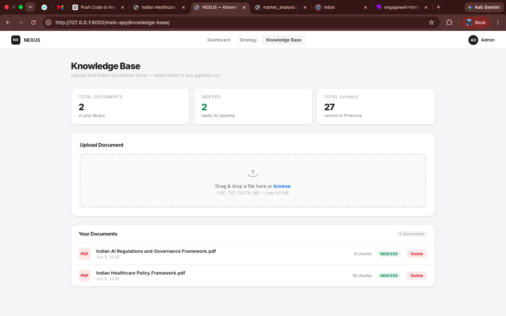
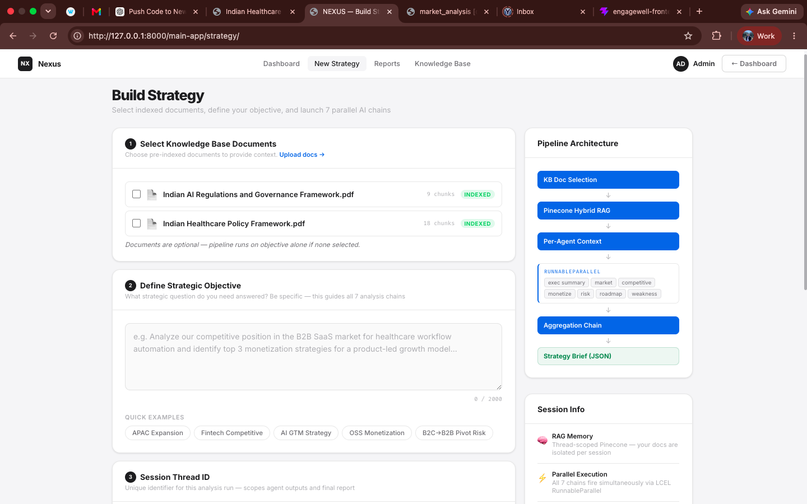

# Autonomous AI Strategy Engine

A multi-agent AI system that takes a business objective and autonomously generates a comprehensive, data-backed strategic report — powered by LangChain, Groq, RAG, and parallel agent execution.

---

## What It Does

You give it a business question (e.g. *"Should we expand into the European SaaS market?"*) and it spins up **7 specialized AI agents in parallel**, each researching and reasoning over a different strategic dimension. The result is a structured, synthesized strategy report covering market analysis, competitive landscape, monetization, risk, product roadmap, and more.

---

## Features

- **7 Parallel AI Agents** — Each agent owns a specific domain:
  - Executive Summary
  - Market Analysis (TAM/SAM/SOM, growth trends)
  - Competitive Landscape (Porter's Five Forces, positioning gaps)
  - Monetization Strategy (pricing models, unit economics)
  - Risk Assessment (regulatory, geopolitical, operational)
  - Product Roadmap (phases, milestones, timelines)
  - Weakness Review (pattern identification, top recommendations)

- **RAG Pipeline** — Upload your own documents (PDF, DOCX, TXT, MD). Agents retrieve relevant context using FAISS (local) and Pinecone (cloud) vector search.

- **Real-time Streaming** — Watch each agent execute live via Server-Sent Events (SSE) + Redis pub/sub.

- **Knowledge Base** — Manage a personal document library. Documents are chunked, embedded, and indexed for use across strategy sessions.

- **Web Search Tool** — Agents use DuckDuckGo to pull in live market data during analysis.

- **Regulatory Intelligence Tool** — Built-in compliance rules by industry and geography.

- **Auth System** — Email/password + Google & GitHub OAuth2. JWT session management with password reset via email.

- **Dashboard** — Track all strategy sessions, success rates, runtime stats, and report history.

---

## Tech Stack

| Layer | Technology |
|---|---|
| Backend | Django 6.0, Django REST Framework |
| LLM | Groq (`llama-4-scout-17b-16e-instruct`) |
| LLM Orchestration | LangChain |
| Embeddings | HuggingFace `BAAI/bge-small-en-v1.5` + Google Gemini (fallback) |
| Vector DB | Pinecone (cloud) + FAISS (local) |
| Task Queue | Celery 5 + Redis |
| Streaming | Django SSE + Redis pub/sub |
| Auth | JWT (SimpleJWT) + OAuth2 (Google, GitHub) |
| Database | SQLite (dev) |
| Web Search | DuckDuckGo Search API |
| Doc Processing | pypdf, python-docx, LangChain text splitters |
| API Docs | drf-spectacular (Swagger UI) |

---

## Architecture Overview

```
User Query
    │
    ▼
Query Validation (Groq)
    │
    ▼
Document Pipeline
  ├── Load uploaded docs (PDF/DOCX/TXT/MD)
  ├── Chunk & embed (HuggingFace)
  └── Store in FAISS (local) + Pinecone (cloud)
    │
    ▼
7 Parallel Celery Tasks (one per agent)
  Each agent:
  ├── Retrieves RAG context (FAISS/Pinecone)
  ├── Calls tools (WebSearch, MarketData, RegulatoryDB)
  └── Returns structured JSON response
    │
    ▼
Aggregation Layer (Groq)
    │
    ▼
Final Strategy Report (saved to DB + returned to frontend)
```

---

## Screenshots

| Dashboard | Reports |
|-----------|---------|
|  |  |

| Knowledge Base | Strategy |
|-----------|---------|
|  |  |
---

## Getting Started

### Prerequisites

- Python 3.10+
- Redis (running locally on port 6379)
- A Groq API key (free at [console.groq.com](https://console.groq.com))
- A Gemini API key (free at [aistudio.google.com](https://aistudio.google.com))
- A Pinecone account (free tier works)

### 1. Clone the Repository

```bash
git clone https://github.com/your-username/autonomous-ai-strategy-engine.git
cd autonomous-ai-strategy-engine
```

### 2. Create a Virtual Environment

```bash
python -m venv env
source env/bin/activate        # Linux/Mac
env\Scripts\activate           # Windows
```

### 3. Install Dependencies

```bash
pip install -r requirements.txt
```

### 4. Configure Environment Variables

Copy the example file and fill in your keys:

```bash
cp .env.example .env
```

Open `.env` and set the following:

```env
# AI APIs
GROQ_API_KEY=your_groq_api_key
GEMINI_API_KEY=your_gemini_api_key

# Pinecone Vector DB
pinecone_Api_key=your_pinecone_api_key
PINECONE_INDEX_NAME=documents
PINECONE_CLOUD=aws
PINECONE_REGION=us-east-1

# Email (Gmail SMTP — use an App Password)
EMAIL_HOST_USER=your@gmail.com
EMAIL_HOST_PASSWORD=your_gmail_app_password
DEFAULT_FROM_EMAIL=your@gmail.com

# OAuth (optional — for Google/GitHub login)
GOOGLE_CLIENT_ID=your_google_client_id
GOOGLE_CLIENT_SECRET=your_google_client_secret
GITHUB_CLIENT_ID=your_github_client_id
GITHUB_CLIENT_SECRET=your_github_client_secret

# Redis
CELERY_BROKER_URL=redis://localhost:6379/0
```

### 5. Run Database Migrations

```bash
python manage.py migrate
```

### 6. Start Redis

```bash
redis-server
```

### 7. Start Celery Worker

```bash
celery -A Ai_strategy_engine worker --loglevel=info
```

### 8. Run the Development Server

```bash
python manage.py runserver
```

Open [http://localhost:8000](http://localhost:8000) in your browser.

---

## API Documentation

Swagger UI is available at:

```
http://localhost:8000/api/schema/swagger-ui/
```

### Key Endpoints

| Method | Endpoint | Description |
|---|---|---|
| `POST` | `/auth-api/user_signup/` | Register a new user |
| `POST` | `/auth-api/user_login/` | Login and get JWT tokens |
| `GET` | `/main-app/generate-thread-id/` | Create a new strategy session |
| `POST` | `/main-app/api/validate-query/` | Validate query before running |
| `POST` | `/main-app/pipeline/start/` | Launch the 7-agent strategy pipeline |
| `GET` | `/main-app/pipeline/stream/<thread_id>/` | SSE stream for live execution |
| `GET` | `/main-app/api/report/<thread_id>/` | Fetch completed strategy report |
| `GET` | `/main-app/api/reports/` | List all reports (paginated) |
| `POST` | `/main-app/api/knowledge-base/` | Upload a document to knowledge base |
| `GET` | `/main-app/api/dashboard/stats/` | Dashboard stats and metrics |

---

## Project Structure

```
Ai_strategy_engine/
├── Ai_strategy_engine/       # Django project config (settings, celery, urls)
├── auth_app/                 # Authentication (signup, login, OAuth, JWT)
├── main_app/                 # Core engine
│   ├── chains.py             # LangChain agent chains
│   ├── tools.py              # WebSearch & regulatory tools
│   ├── prompt_services.py    # Prompts for all 7 agents
│   ├── rag_services.py       # RAG retrieval pipeline
│   ├── embedding_service.py  # HuggingFace + Gemini embeddings
│   ├── pinecone_service.py   # Pinecone integration
│   └── main_pipeline.py      # Document processing pipeline
├── templates/                # Django HTML templates (frontend)
├── media/                    # Uploaded files (documents, knowledge base)
├── faiss_indexes/            # Per-thread FAISS vector indexes
├── requirements.txt
└── .env.example
```

---

## AI Agents in Detail

| Agent | What It Does |
|---|---|
| **Executive Summary** | Problem framing, strategic opportunity, time-to-market estimate |
| **Market Analysis** | TAM/SAM/SOM sizing, growth projections, trend identification |
| **Competitive Landscape** | Competitor mapping, Porter's Five Forces, positioning gaps |
| **Monetization Strategy** | Pricing models, revenue streams, unit economics (LTV/CAC) |
| **Risk Assessment** | Regulatory compliance, geopolitical risks, mitigation strategies |
| **Product Roadmap** | Development phases, feature prioritization, milestone timelines |
| **Weakness Review** | Cross-agent pattern analysis, critical gaps, top 5 recommendations |

Each agent uses the **same LLM (Groq)** but with different system prompts, tools, and RAG contexts. All 7 run as parallel Celery tasks, and their outputs are aggregated into a single final strategy by a synthesis layer.

---

## Environment Variables Reference

| Variable | Required | Description |
|---|---|---|
| `GROQ_API_KEY` | Yes | Groq LLM API key |
| `GEMINI_API_KEY` | Yes | Google Gemini API key (embeddings fallback) |
| `pinecone_Api_key` | Yes | Pinecone vector DB key |
| `PINECONE_INDEX_NAME` | Yes | Pinecone index name (e.g. `documents`) |
| `CELERY_BROKER_URL` | Yes | Redis URL for Celery |
| `EMAIL_HOST_USER` | Yes | Gmail address for sending emails |
| `EMAIL_HOST_PASSWORD` | Yes | Gmail App Password |
| `GOOGLE_CLIENT_ID` | No | Google OAuth client ID |
| `GOOGLE_CLIENT_SECRET` | No | Google OAuth client secret |
| `GITHUB_CLIENT_ID` | No | GitHub OAuth client ID |
| `GITHUB_CLIENT_SECRET` | No | GitHub OAuth client secret |

---

## Contributing

Pull requests are welcome. For major changes, open an issue first to discuss what you'd like to change.

---

## License

[MIT](LICENSE)

---

## Author

Built by **Karan Chandel**

- GitHub: [your-github-profile](https://github.com/your-username)
- LinkedIn: [your-linkedin](https://linkedin.com/in/your-profile)
