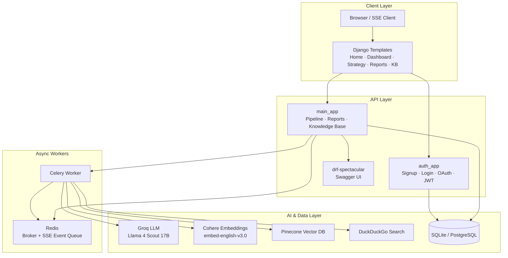
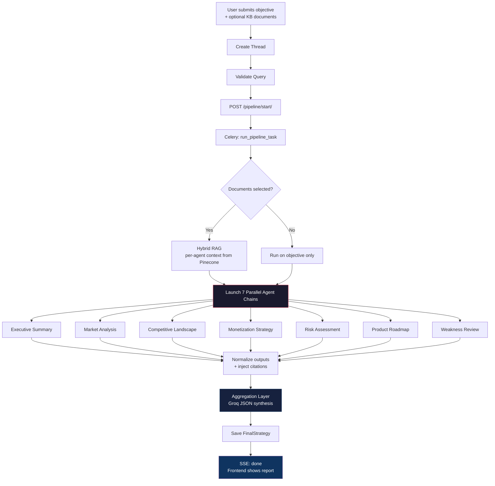
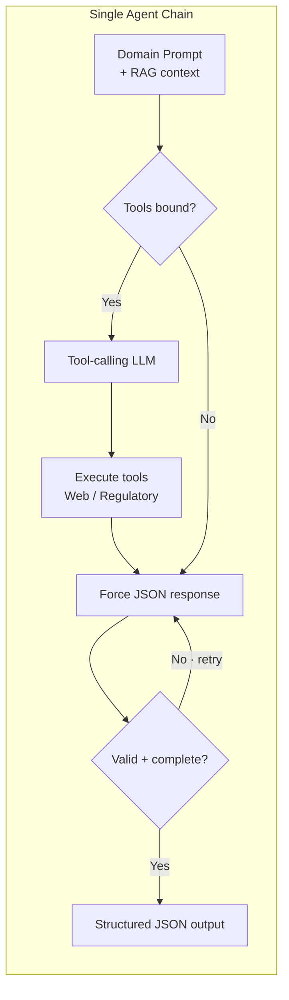
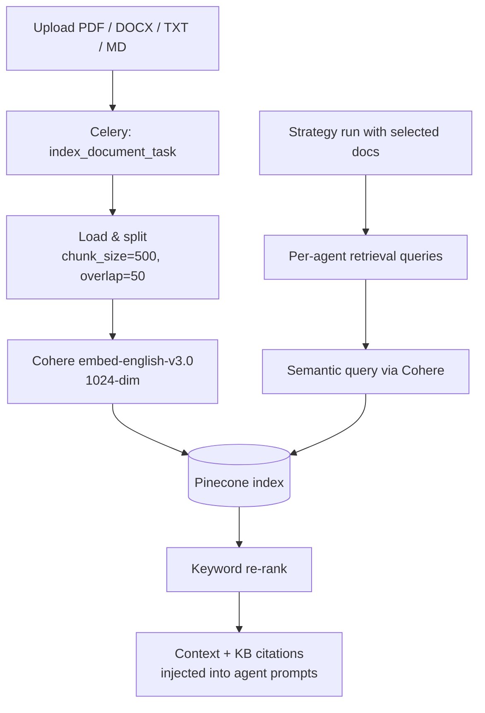
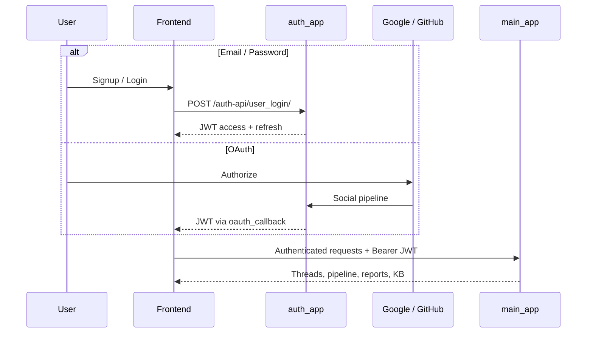
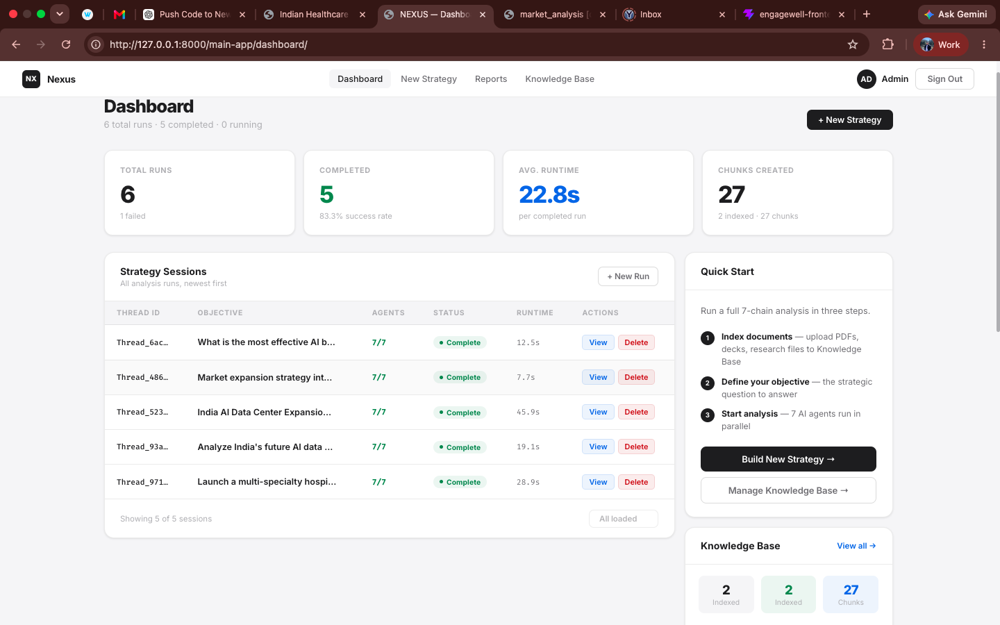
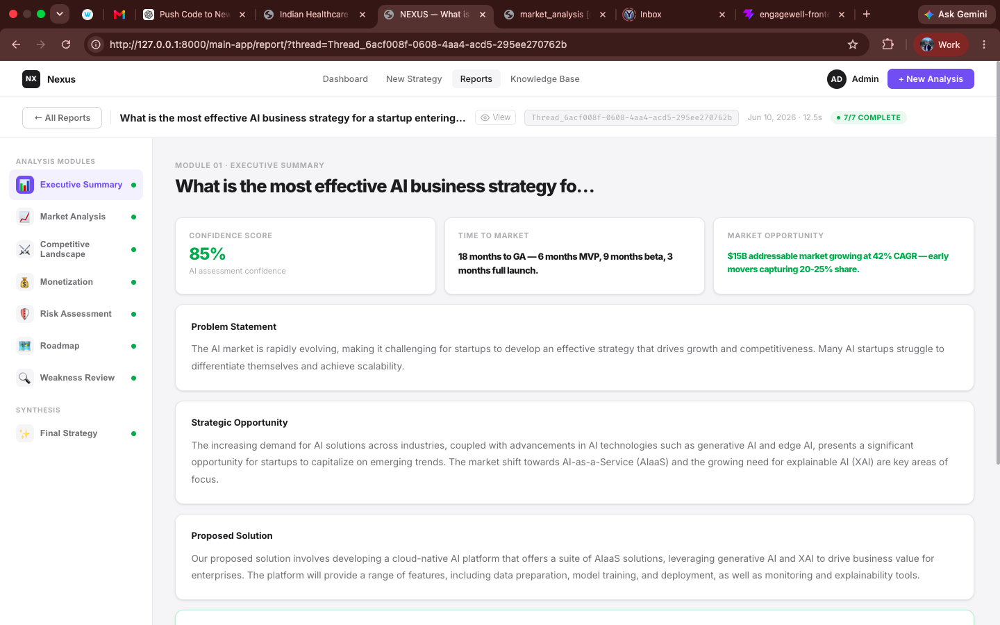
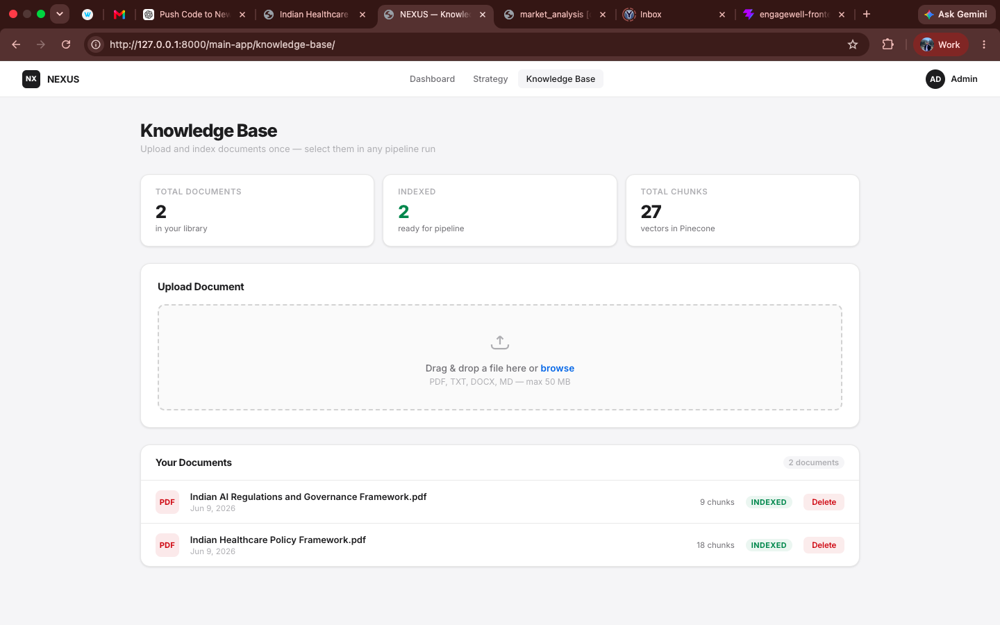
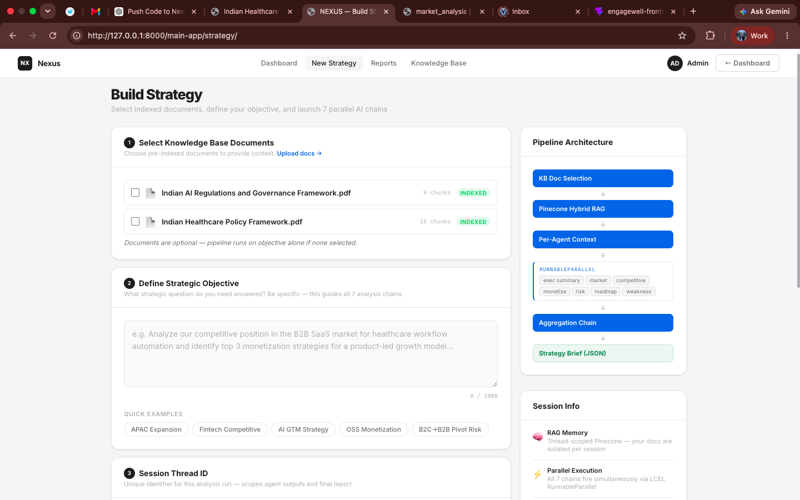

# Autonomous AI Strategy Engine


A multi-agent AI system that turns a business objective into a comprehensive, data-backed strategic report — powered by LangChain, Groq, hybrid RAG (Cohere + Pinecone), and parallel agent execution.

---

## Demo

> Full walkthrough: query input → live agent execution → final strategy report

https://github.com/karan-chandel-asc/Autonomous-Ai-Strategy-Engine/raw/main/demo/demo_vedio.mov

---

## What It Does

Give it a business question — e.g. *"Should we expand into the European SaaS market?"* — and it launches **7 specialized AI agents in parallel**. Each agent researches and reasons over a different strategic dimension, then a synthesis layer merges their outputs into one structured strategy report.

Agents ground answers with:

- **Your documents** (PDF / DOCX / TXT / MD) via hybrid RAG
- **Live web search** (DuckDuckGo)
- **Regulatory intelligence** (industry + geography rules)

---

## Features

| Feature | Description |
|---|---|
| **7 Parallel AI Agents** | Executive Summary, Market Analysis, Competitive Landscape, Monetization, Risk, Product Roadmap, Weakness Review |
| **Hybrid RAG** | Knowledge Base docs chunked → Cohere embeddings → Pinecone retrieval + keyword re-rank |
| **Real-time Streaming** | Watch agents run live via SSE + Redis pub/sub |
| **Knowledge Base** | Personal document library; async indexing with Celery |
| **Web Search Tools** | DuckDuckGo-backed tools for market, competitor, and context search |
| **Regulatory Tool** | Built-in compliance rules by industry, geography, and data type |
| **Auth** | Email/password + Google & GitHub OAuth2; JWT sessions; password reset via email |
| **Dashboard** | Session history, success rates, runtime stats, report archive |
| **API Docs** | OpenAPI / Swagger via drf-spectacular |

---

## Architecture

### System overview


```mermaid
flowchart TB
    subgraph Client["Client Layer"]
        UI["Django Templates<br/>Home · Dashboard · Strategy · Reports · KB"]
        Browser["Browser / SSE Client"]
    end

    subgraph API["API Layer"]
        Auth["auth_app<br/>Signup · Login · OAuth · JWT"]
        Main["main_app<br/>Pipeline · Reports · Knowledge Base"]
        Swagger["drf-spectacular<br/>Swagger UI"]
    end

    subgraph Workers["Async Workers"]
        Celery["Celery Worker"]
        Redis["Redis<br/>Broker + SSE Event Queue"]
    end

    subgraph AI["AI & Data Layer"]
        Groq["Groq LLM<br/>Llama 4 Scout 17B"]
        Cohere["Cohere Embeddings<br/>embed-english-v3.0"]
        Pinecone["Pinecone Vector DB"]
        DDG["DuckDuckGo Search"]
        DB[(SQLite / PostgreSQL)]
    end

    Browser --> UI
    UI --> Auth
    UI --> Main
    Main --> Swagger
    Main --> Celery
    Celery --> Redis
    Main --> Redis
    Celery --> Groq
    Celery --> Cohere
    Celery --> Pinecone
    Celery --> DDG
    Auth --> DB
    Main --> DB
```

### Strategy pipeline (end-to-end)


```mermaid
flowchart TD
    A[User submits objective<br/>+ optional KB documents] --> B[Create Thread]
    B --> C[Validate Query]
    C --> D[POST /pipeline/start/]
    D --> E[Celery: run_pipeline_task]

    E --> F{Documents selected?}
    F -->|Yes| G[Hybrid RAG<br/>per-agent context from Pinecone]
    F -->|No| H[Run on objective only]
    G --> I
    H --> I

    I[Launch 7 Parallel Agent Chains]

    I --> J1[Executive Summary]
    I --> J2[Market Analysis]
    I --> J3[Competitive Landscape]
    I --> J4[Monetization Strategy]
    I --> J5[Risk Assessment]
    I --> J6[Product Roadmap]
    I --> J7[Weakness Review]

    J1 & J2 & J3 & J4 & J5 & J6 & J7 --> K[Normalize outputs<br/>+ inject citations]
    K --> L[Aggregation Layer<br/>Groq JSON synthesis]
    L --> M[Save FinalStrategy]
    M --> N[SSE: done<br/>Frontend shows report]

    style I fill:#1a1a2e,stroke:#e94560,color:#fff
    style L fill:#16213e,stroke:#0f3460,color:#fff
    style N fill:#0f3460,stroke:#533483,color:#fff
```

### Per-agent execution


```mermaid
flowchart LR
    subgraph Agent["Single Agent Chain"]
        P[Domain Prompt<br/>+ RAG context] --> T{Tools bound?}
        T -->|Yes| U[Tool-calling LLM]
        U --> V[Execute tools<br/>Web / Regulatory]
        V --> W[Force JSON response]
        T -->|No| W
        W --> X{Valid + complete?}
        X -->|No · retry| W
        X -->|Yes| Y[Structured JSON output]
    end
```

### Knowledge Base / RAG flow


```mermaid
flowchart TD
    U[Upload PDF / DOCX / TXT / MD] --> C[Celery: index_document_task]
    C --> L[Load & split<br/>chunk_size=500, overlap=50]
    L --> E[Cohere embed-english-v3.0<br/>1024-dim]
    E --> P[(Pinecone index)]

    Q[Strategy run with selected docs] --> R[Per-agent retrieval queries]
    R --> S[Semantic query via Cohere]
    S --> P
    P --> K[Keyword re-rank]
    K --> CTX[Context + KB citations<br/>injected into agent prompts]
```

### Auth & session flow


```mermaid
sequenceDiagram
    participant U as User
    participant FE as Frontend
    participant Auth as auth_app
    participant OAuth as Google / GitHub
    participant API as main_app

    alt Email / Password
        U->>FE: Signup / Login
        FE->>Auth: POST /auth-api/user_login/
        Auth-->>FE: JWT access + refresh
    else OAuth
        U->>OAuth: Authorize
        OAuth->>Auth: Social pipeline
        Auth-->>FE: JWT via oauth_callback
    end

    FE->>API: Authenticated requests + Bearer JWT
    API-->>FE: Threads, pipeline, reports, KB
```

---

## Screenshots

| Dashboard | Reports |
|-----------|---------|
|  |  |

| Knowledge Base | Strategy |
|-----------|---------|
|  |  |

---

## Tech Stack

| Layer | Technology |
|---|---|
| Backend | Django 5.2, Django REST Framework |
| LLM | Groq — `llama-3.3-70b-versatile` (override via `GROQ_MODEL`) |
| Orchestration | LangChain (`RunnableParallel` agent chains) |
| Embeddings | Cohere `embed-english-v3.0` (1024-dim) |
| Vector DB | Pinecone (serverless) |
| Task Queue | Celery 5 + Redis |
| Streaming | Django SSE + Redis list pub/sub |
| Auth | SimpleJWT + social-auth (Google, GitHub) |
| Database | SQLite (dev) · PostgreSQL via `DATABASE_URL` (prod) |
| Web Search | DuckDuckGo Search |
| Doc Processing | pypdf, docx2txt, LangChain text splitters |
| Static / Deploy | WhiteNoise, Gunicorn, dj-database-url |
| API Docs | drf-spectacular (Swagger UI) |

---

## Getting Started

### Prerequisites

- **Python 3.11+**
- **Redis** running locally on port `6379`
- API keys:
  - [Groq](https://console.groq.com) — LLM
  - [Cohere](https://dashboard.cohere.com) — embeddings
  - [Pinecone](https://www.pinecone.io) — vector DB (free tier works)
  - Gmail App Password — email (password reset)
  - Google / GitHub OAuth credentials — optional

### 1. Clone

```bash
git clone https://github.com/karan-chandel-asc/Autonomous-Ai-Strategy-Engine.git
cd Autonomous-Ai-Strategy-Engine
```

### 2. Virtual environment

```bash
python -m venv env

# Linux / macOS
source env/bin/activate

# Windows
env\Scripts\activate
```

### 3. Install dependencies

```bash
pip install -r requirements.txt
```

### 4. Environment variables

```bash
cp .env.example .env
```

Fill in `.env`:

```env
# AI APIs
GROQ_API_KEY=your_groq_api_key
GROQ_MODEL=llama-3.3-70b-versatile
GEMINI_API_KEY=your_gemini_api_key
cohre_embedding_api_key=your_cohere_api_key

# Pinecone
pinecone_Api_key=your_pinecone_api_key
PINECONE_INDEX_NAME=documents
PINECONE_CLOUD=aws
PINECONE_REGION=us-east-1

# Email (Gmail App Password)
EMAIL_HOST_USER=your@gmail.com
EMAIL_HOST_PASSWORD=your_gmail_app_password
DEFAULT_FROM_EMAIL=your@gmail.com

# OAuth (optional)
GOOGLE_CLIENT_ID=...
GOOGLE_CLIENT_SECRET=...
GITHUB_CLIENT_ID=...
GITHUB_CLIENT_SECRET=...

# Redis / Celery
CELERY_BROKER_URL=redis://localhost:6379/0

# Django (recommended for local)
DEBUG=True
SECRET_KEY=change-me-locally
```

### 5. Migrate

```bash
python manage.py migrate
```

### 6. Start Redis

```bash
redis-server
```

### 7. Start Celery worker

```bash
celery -A Ai_strategy_engine worker --loglevel=info
```

### 8. Run the server

```bash
python manage.py runserver
```

Open **[http://localhost:8000](http://localhost:8000)** — redirects to `/main-app/home/`.

---

## How a Strategy Run Works

1. **Authenticate** — sign up / log in (JWT stored client-side).
2. **Create a thread** — `GET /main-app/generate-thread-id/`.
3. **Validate the query** — `POST /main-app/api/validate-query/`.
4. **Optionally attach KB docs** — select indexed Knowledge Base documents.
5. **Start pipeline** — `POST /main-app/pipeline/start/`.
6. **Watch live progress** — SSE on `/main-app/pipeline/stream/<thread_id>/`.
7. **Read the report** — `GET /main-app/api/report/<thread_id>/` or the Reports UI.

Typical SSE steps: `start` → `doc_loaded` → `rag_retrieval` → `rag_done` → `agents_start` → `agent_*` × 7 → `aggregating` → `done`.

---

## AI Agents

| Agent | Focus | Tools |
|---|---|---|
| **Executive Summary** | Problem, opportunity, solution, time-to-market, confidence | ExecutiveContextSearch |
| **Market Analysis** | Market size, growth, trends, drivers, challenges | MarketSearch |
| **Competitive Landscape** | Competitors, Porter's Five Forces, positioning gaps | CompetitorWebSearch |
| **Monetization Strategy** | Pricing models, revenue streams, LTV/CAC, ARR projection | — |
| **Risk Assessment** | Operational / regulatory / geopolitical risks + mitigation | RegulatoryRiskChecker |
| **Product Roadmap** | Phases, milestones, estimated weeks | — |
| **Weakness Review** | Cross-cutting gaps, dominant patterns, top recommendations | — |

All seven run as a **LangChain `RunnableParallel`** graph inside one Celery task. Outputs are normalized, citations (KB + web) are attached, then an aggregation model produces the final brief.

---

## API Documentation

Swagger UI:

```
http://localhost:8000/api/schema/swagger-ui/
```

### Key endpoints

| Method | Endpoint | Description |
|---|---|---|
| `POST` | `/auth-api/user_signup/` | Register |
| `POST` | `/auth-api/user_login/` | Login → JWT |
| `POST` | `/auth-api/user_logout/` | Logout / blacklist |
| `GET`  | `/auth-api/user_profile/` | Profile |
| `POST` | `/auth-api/forgot_password/` | Password reset email |
| `GET`  | `/main-app/generate-thread-id/` | New strategy session |
| `POST` | `/main-app/api/validate-query/` | Validate objective |
| `POST` | `/main-app/pipeline/start/` | Launch 7-agent pipeline |
| `GET`  | `/main-app/pipeline/stream/<thread_id>/` | SSE live progress |
| `GET`  | `/main-app/api/report/<thread_id>/` | Completed report |
| `GET`  | `/main-app/api/reports/` | Paginated report list |
| `GET`  | `/main-app/api/dashboard/stats/` | Dashboard metrics |
| `POST` | `/main-app/api/knowledge-base/` | Upload KB document |
| `GET`  | `/main-app/api/knowledge-base/` | List KB documents |
| `DELETE` | `/main-app/api/knowledge-base/<uuid>/` | Delete KB document |

### UI routes

| Path | Page |
|---|---|
| `/main-app/home/` | Landing |
| `/main-app/dashboard/` | Stats & history |
| `/main-app/strategy/` | Run a new strategy |
| `/main-app/report/` | View reports |
| `/main-app/knowledge-base/` | Manage documents |
| `/main-app/profile/` | User profile |

---

## Project Structure

```
Autonomous-Ai-Strategy-Engine/
├── Ai_strategy_engine/          # Django project (settings, urls, celery, logging)
├── auth_app/                    # Auth, OAuth pipeline, JWT, password reset
├── main_app/                    # Core strategy engine
│   ├── chains.py                # Parallel agents + aggregation
│   ├── tasks.py                 # Celery: pipeline + KB indexing
│   ├── tools.py                 # DuckDuckGo + regulatory tools
│   ├── layer_wise_tools.py      # Per-agent tool binding
│   ├── prompt_services.py       # Prompts for all 7 agents
│   ├── embedding_service.py     # Cohere embeddings
│   ├── pinecone_service.py      # Pinecone index / query / delete
│   ├── helper.py                # Thread helpers + HybridRAGService
│   ├── langchain_models.py      # Groq chat models
│   ├── models.py                # Thread, AgentResponse, FinalStrategy, KB
│   ├── views.py                 # API + template views
│   └── urls.py
├── templates/                   # Frontend HTML (ase_*.html)
├── screenshots/                 # README screenshots
├── demo/                        # Demo video
├── manage.py
├── requirements.txt
├── runtime.txt                  # python-3.11.0
├── .env.example
└── LICENSE
```

---

## Environment Variables Reference

| Variable | Required | Description |
|---|---|---|
| `GROQ_API_KEY` | Yes | Groq LLM API key |
| `GROQ_MODEL` | No | Groq model ID (default: `llama-3.3-70b-versatile`) |
| `cohre_embedding_api_key` | Yes* | Cohere API key for embeddings (*required for RAG/KB) |
| `pinecone_Api_key` | Yes* | Pinecone API key (*required for RAG/KB) |
| `PINECONE_INDEX_NAME` | Yes* | Index name (e.g. `documents`) |
| `PINECONE_CLOUD` | No | Default `aws` |
| `PINECONE_REGION` | No | Default `us-east-1` |
| `CELERY_BROKER_URL` | Yes | Redis URL for Celery |
| `EMAIL_HOST_USER` | Yes | Gmail for transactional email |
| `EMAIL_HOST_PASSWORD` | Yes | Gmail App Password |
| `GEMINI_API_KEY` | Optional | Reserved / legacy |
| `GOOGLE_CLIENT_ID` / `SECRET` | No | Google OAuth |
| `GITHUB_CLIENT_ID` / `SECRET` | No | GitHub OAuth |
| `DATABASE_URL` | No | Postgres URL in production; else SQLite |
| `DEBUG` | No | Set `True` for local development |
| `SECRET_KEY` | Prod | Django secret key |
| `ALLOWED_HOSTS` | Prod | Comma-separated hosts |

---

## Local Development Tips

- Run **three processes**: Redis, Celery worker, Django `runserver`.
- Without KB docs selected, the pipeline still runs using the objective + web/regulatory tools.
- For breakpoint debugging of tasks, you can temporarily set `CELERY_TASK_ALWAYS_EAGER = True` in settings (dev only).
- Swagger is the fastest way to exercise APIs without the UI.

---

## Contributing

Pull requests are welcome. For larger changes, open an issue first to discuss the approach.

1. Fork the repo  
2. Create a feature branch (`git checkout -b feature/your-idea`)  
3. Commit with a clear message  
4. Open a PR  

---

## License

Distributed under the [MIT License](LICENSE).

---

## Author

Built by **Karan Chandel**

- GitHub: [karan-chandel-asc](https://github.com/karan-chandel-asc)
- Repository: [Autonomous-Ai-Strategy-Engine](https://github.com/karan-chandel-asc/Autonomous-Ai-Strategy-Engine)
